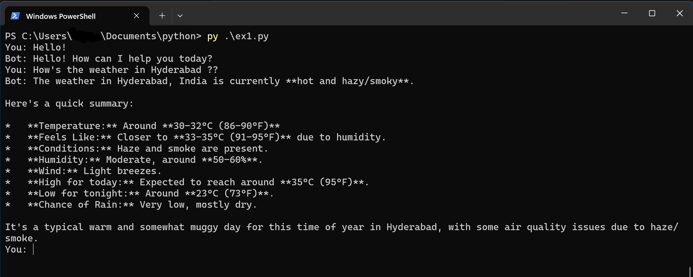
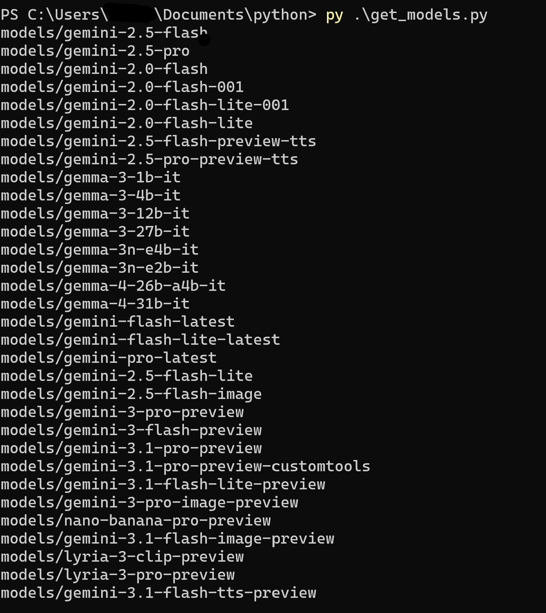

# Python Project

A Python project using Google's Generative AI API.

## Files
AI
- **ex1.py** - Alternative implementation using Google's genai client
- **get_models.py** - Utility for retrieving available models

## Prerequisites

- Python 3.7+
- Google Generative AI API key

## Installation

1. Install dependencies:
```bash
pip install google-generativeai
```

2. Set up your API key:
   - Go to https://aistudio.google.com/welcome
   - Create a Project
   - Add your API key to the scripts (or use environment variables)

## Usage

Run the chat application:
```bash
python app.py
```

Or use the alternative implementation:
```bash
python ex1.py
```

Type 'exit' to quit the chat.

## Example 


## List All Models

## License

MIT
