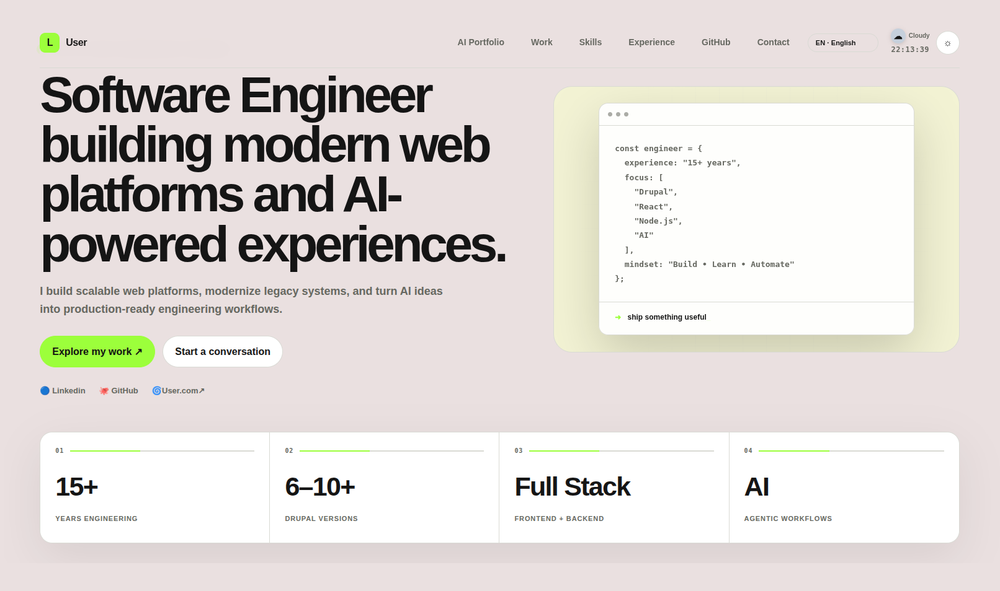
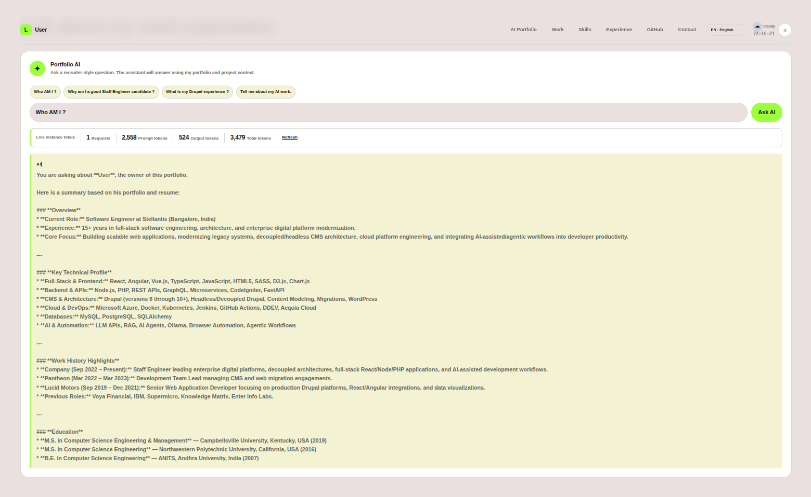

# AI-Powered Staff Engineer Portfolio

A static Next.js frontend with a separate Node.js/Express backend for GitHub, Gemini, and usage APIs.

## Features

- Modern responsive portfolio
- Dark/light mode
- Staff Engineer / Full Stack positioning
- Projects, skills, experience and contact sections
- Live public GitHub repository cards
- AI recruiter/portfolio assistant
- Server-side API key handling
- No UI component framework required

## AI Portfolio Screenshots





## 1. Install

```bash
npm install
```

## 2. Configure AI

Copy `.env.example` to `.env.local`:

```bash
cp .env.example .env.local
```

Set:

```env
GEMINI_API_KEY=your_key
GEMINI_MODEL=gemini-3.6-flash
```

Required for the protected admin usage endpoint:

```env
ADMIN_TOKEN=choose-a-private-admin-token
```

The site works without the AI key; the assistant will show a setup message.

For a Groq alternative, configure the route to use Groq and add:

```env
GROQ_API_KEY=your_groq_key
GROQ_MODEL=openai/gpt-oss-120b
```

Optional:

```env
GITHUB_TOKEN=your_token
```

A token is not required for public repositories.

## 3. Configure frontend and backend

Set the backend origin when building the static frontend:

```env
NEXT_PUBLIC_API_URL=https://api.example.com
FRONTEND_ORIGIN=https://lakshm.in
PORT=4000
```

`NEXT_PUBLIC_API_URL` is embedded into the static JavaScript at build time. The
backend keeps `GEMINI_API_KEY`, `GITHUB_TOKEN`, and `ADMIN_TOKEN` server-side.

## 4. Run locally

```bash
npm run dev
npm run dev:backend
```

Open http://localhost:3000

For local frontend calls, leave `NEXT_PUBLIC_API_URL` empty and proxy `/api`
through your local web server, or set it to `http://localhost:4000` before
building.

## 5. Customize

Edit `data/profile.ts` for:

- name
- title
- email
- LinkedIn
- GitHub
- experience
- projects
- skills

The AI assistant automatically receives this portfolio context through the server route.

## 6. Gemini usage

Open http://localhost:3000/admin to view request counts and prompt, output, and
total token counts reported by Gemini. Enter the required `ADMIN_TOKEN` on the
admin page. Usage is kept in server memory for the current application
instance, so it resets when the server restarts and is not a replacement for
Google AI billing reports.

To improve answer accuracy, paste the plain-text content of your resume into
`data/resume.txt`. The file is read only by the server and is added to the
assistant's private context; it is never sent to the browser. Keep personal
secrets and API keys out of the resume file.

## 7. Deploy

Build the static frontend with `npm run build:frontend` and upload the generated
`out/` directory to InfinityFree. Deploy the Node backend separately on a Node
hosting provider, configure HTTPS, `FRONTEND_ORIGIN=https://lakshm.in`, and set
`NEXT_PUBLIC_API_URL` to that backend's HTTPS URL before building the frontend.
Do not upload `.env.local` or expose Gemini and admin secrets in frontend code.

Recommended:

```bash
npm run build:frontend
npm run start:backend
```

## Important

Replace the placeholder email and LinkedIn URL in `data/profile.ts` before publishing.


## Languages

The portfolio now supports:
- English (EN)
- Hindi (हिन्दी)
- French (FR)

The language selector is in the header. The selection is saved in the browser using localStorage. Project descriptions and technical data remain in their source language, while the main navigation and portfolio UI are translated.
